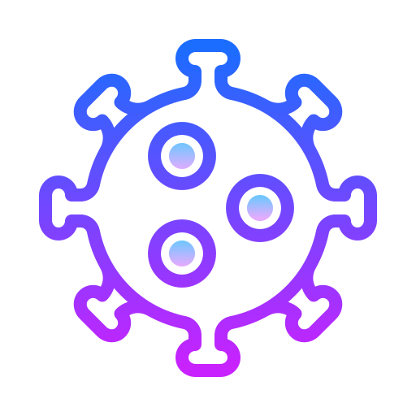

  

<h1 align="center">
  COVID19 Tracker
</h1>

_A bot that tracks and display the global and random countrywise stats of COVID-19 within the Slack workspace_ :mask:  

> This bot is powered by the custom build [COVID19 Tracker API](https://github.com/) and the scraped data from [Worldometer](https://www.worldometers.info/coronavirus/)

## Installation
1. Fork and clone the git repository
2. Install all the dependencies stated in `package.json`
2. Create MongoDB Atlas Cluster
3. Create Classic Slack Bot App
4. In the root directory, you will find a `example.env` file, duplicate it and rename it to `.env` only.
5. Change the env variables to fit your environment.
4. Run `npm start`
5. Open slack wokrspace and use command `help` to get started.

## Output Screens

## Author

- [Tarun Varshney](http://www.tarunvarshney.tech/)

## References

[Slack Real Time Messaging](https://api.slack.com/rtm)

[Build A Slackbot](https://www.youtube.com/watch?v=nyyXTIL3Hkw&t=0s)